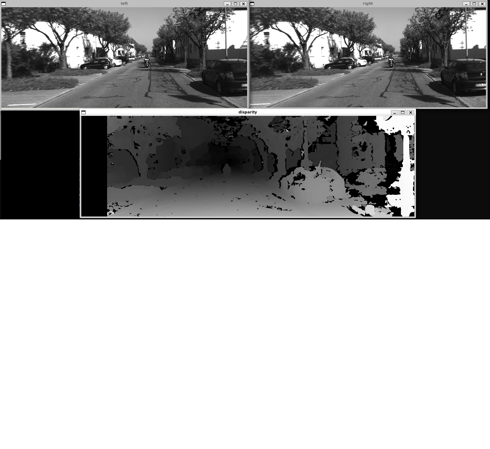
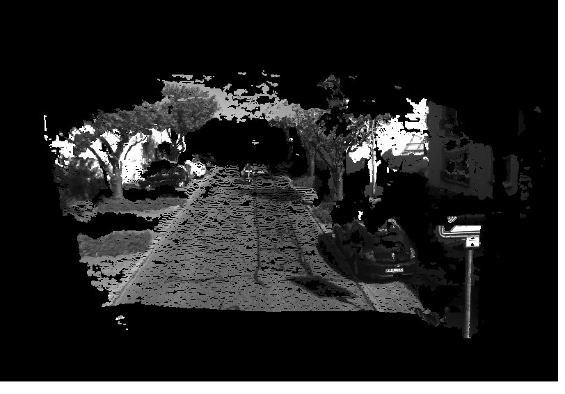

# CV Basic Projects

This folder contains fundamental computer vision projects using OpenCV, Eigen, and Pangolin. These projects demonstrate key concepts in image processing, camera calibration, and 3D vision.

## Projects Overview

### 1. **CV Basic** (`cv_basic.cpp`)
Basic image processing demonstration that shows how to:
- Load and read images using OpenCV
- Access pixel values efficiently using row pointers
- Benchmark image pixel iteration performance
- Display image properties (dimensions, channels)

**Key Concepts:**
- Image I/O with OpenCV
- Direct pixel access and manipulation
- Performance measurement

### 2. **Chessboard Calibration** (`chessboard_calibrate.cpp`)
Camera calibration using a chessboard pattern. This project:
- Detects chessboard corners in multiple calibration images
- Estimates camera intrinsic parameters (focal length, principal point)
- Computes lens distortion coefficients
- Uses calibration results for stereo vision setup

**Key Concepts:**
- Camera intrinsic matrix estimation
- Lens distortion modeling (radial and tangential)
- Chessboard corner detection
- Calibration pipeline for accurate 3D reconstruction

Note : Using images from https://www.kaggle.com/datasets/danielwe14/stereocamera-chessboard-pictures

**Chessboard Pattern:** 11×7 with 30mm square size

### 3. **Stereo Vision & Disparity Mapping** (`stereo.cpp`)
Computes 3D point clouds from stereo image pairs:
- Loads left and right stereo images
- Performs stereo matching using StereoSGBM algorithm
- Computes disparity map from matched features
- Reconstructs 3D points using disparity and baseline
- Visualizes point cloud with Pangolin

**Key Concepts:**
- Stereo matching and disparity computation
- 3D reconstruction from stereo pairs
- Semi-Global Block Matching (SGBM) algorithm
- Point cloud visualization

**Stereo Setup:**
- Focal length (fx, fy): 718.856 pixels
- Principal point (cx, cy): (607.19, 185.22)
- Baseline: 0.573 meters

**Output:** [stereo_disparity.png](stereo_disparity.png)

### 4. **Image Undistortion** (`undistort.cpp`)
Corrects lens distortion in images:
- Applies inverse radial-tangential distortion model
- Computes undistorted pixel coordinates
- Remaps distorted image to undistorted space
- Handles boundary pixels appropriately

**Key Concepts:**
- Lens distortion models (radial and tangential)
- Inverse distortion mapping
- Pixel coordinate transformation
- Image remapping

**Distortion Parameters:**
- Radial: k1 = -0.2834, k2 = 0.0740
- Tangential: p1 = 0.0002, p2 = 1.76e-05
- Camera matrix: fx = 458.654, fy = 457.296, cx = 367.215, cy = 248.375

---

## Output Images

### Stereo Disparity Map

This shows the disparity (depth difference) computed from stereo matching. Brighter areas indicate closer objects.

### 3D Point Cloud Visualization

3D reconstruction of the scene from stereo pairs, visualized using Pangolin.

---

## Building and Running

The projects are built using CMake. Each executable takes image files as input:

```bash
# Camera calibration
./chessboard_calibrate <calibration_images_directory>

# Stereo matching and 3D reconstruction
./stereo <left_image> <right_image>

# Image undistortion
./undistort <distorted_image>

# Basic image processing
./cv_basic <image_file>
```

## Dependencies

- **OpenCV** - Image processing and stereo algorithms
- **Eigen** - Linear algebra operations
- **Pangolin** - 3D visualization and plotting
- **C++11 or later**

## Applications

These projects form the foundation for:
- SLAM (Simultaneous Localization and Mapping)
- 3D scene reconstruction
- Camera calibration pipelines
- Stereo vision systems
- Autonomous vehicle perception
- Robot vision systems
